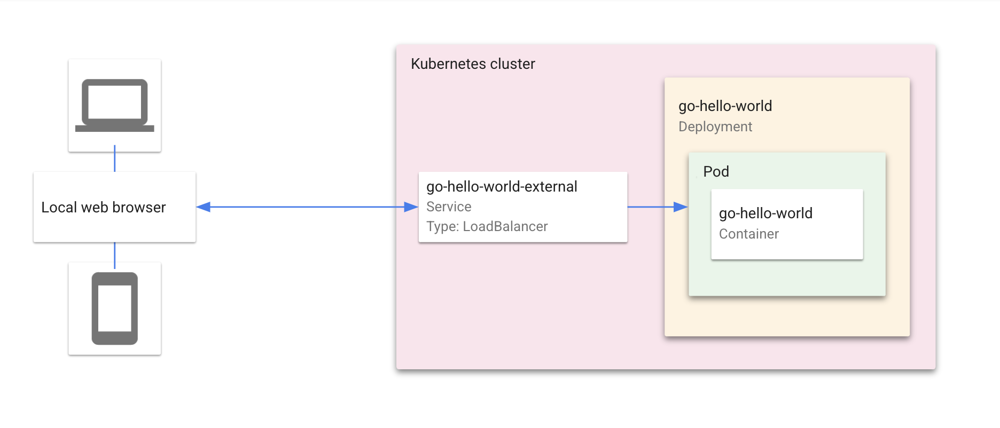

# Demonstration for Software Delivery Shield (IThome Kubernetes Summit 2022)
This is the public github with code used to demonstrate in Kubernetes Summit 2022. The entire demonstration separate into 4 parts:
The first 3 labs was shown under examples folder. The detailed explanation could be found in each of the folder. Here is the overview of the content:

## Software Delivery Shield Demo Projects
1. examples/1_demo-intoto: This workshop refers to the [in-toto demo lab](https://github.com/in-toto/demo). In-toto is a software delivery secure framework, which served as a good example to understand the entire workflow in manual mode as well as the meaning of provenance. 

2. examples/2_demo-cosign: This workshop mainly adopts [sigstore/cosign](https://github.com/sigstore/cosign) project as well as [sigstore/policy-controller](https://github.com/sigstore/policy-controller). It demonstrated how to utilize cosign to attest the container image and to enforce ClusterImagePolicy to enforce the existence of the attestations. 

3. examples/3_demo-binaryauthz: This workshop is to demonstrate a similar process as workshop 2 but with all the toolchains, managed by GCP. Instead of Cosign, [CloudBuild](https://cloud.google.com/build/docs/securing-builds/view-build-provenance) managed service attests the container image with in-toto attestations. In the deployment time, [Binary Authorization](https://cloud.google.com/binary-authorization) is used to replace cosign/policy-controller.

## Sample Application: 
"Hello World" is a Kubernetes application that contains a single
[Deployment](https://kubernetes.io/docs/concepts/workloads/controllers/deployment/) and a corresponding
[Service](https://kubernetes.io/docs/concepts/services-networking/service/). The Deployment contains a web server that renders a simple webpage.

For details on how to use this sample as a template in Cloud Code, read the documentation for Cloud Code for [VS Code](https://cloud.google.com/code/docs/vscode/quickstart-local-dev?utm_source=ext&utm_medium=partner&utm_campaign=CDR_kri_gcp_cloudcodereadmes_012521&utm_content=-) or [IntelliJ](https://cloud.google.com/code/docs/intellij/quickstart-k8s?utm_source=ext&utm_medium=partner&utm_campaign=CDR_kri_gcp_cloudcodereadmes_012521&utm_content=-).

### Table of Contents
* [What's in this sample](#whats-in-this-sample)
* [Getting Started with VS Code](#getting-started-with-vs-code)
* [Getting Started with IntelliJ](#getting-started-with-intellij)
* [Sign up for User Research](#sign-up-for-user-research)

---
## What's in this sample
### Kubernetes architecture

### Directory contents

- `skaffold.yaml` - A schema file that defines skaffold configurations ([skaffold.yaml reference](https://skaffold.dev/docs/references/yaml/))
- `kubernetes-manifests/` - Contains Kubernetes YAML files for the Guestbook services and deployments, including:

  - `hello.deployment.yaml` - deploys a pod with the 'go-hello-world' container image
  - `hello.service.yaml` - creates a load balancer and exposes the 'go-hello-world' service on an external IP in the cluster

---
## Getting Started with VS Code

### Run the app locally with minikube

1. To run your application, click on the Cloud Code status bar and select ‘Run on Kubernetes’.  
 

2. Select ‘Run locally using minikube’ when prompted. Cloud Code runs your app in a local [minikube](https://minikube.sigs.k8s.io/docs/start/) cluster.  

3. View the build progress in the OUTPUT window. Once the build has finished, click on the URL in the OUTPUT window to view your live application.  

4.  To stop the application, click the stop icon on the Debug Toolbar.

---
