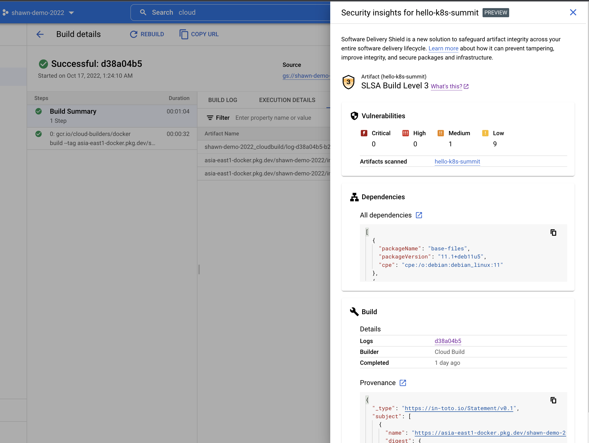

# Image Attestation & Deployment Enforcement Lab on GCP
This demo lab shows case how to use [CloudBuild](https://cloud.google.com/build/docs/securing-builds/view-build-provenance) managed service to attest the container image with in-toto attestations. In the deployment time, [Binary Authorization](https://cloud.google.com/binary-authorization) is used to replace [sigstore/policy-controller](https://github.com/sigstore/policy-controller).

## Pre-requisite
You must have the following resources before executing this lab.
* GKE cluster (any OSS K8s > 1.21 should work)
* Has gcloud CLI pre-installed (better > 401.0.0)
* Has a newly built image in GCP's artifact repository. If not, run the following command in the project main folder.
``` bash
skaffold build --file-output image.json
```

## Steps
### 1_install.sh
This step would enable binary authorization in the corresponding GKE cluster and also configured the Binary Authorization policy. The pre-configured policy would enforce only the signed images could be deployed in the corresponding GKE cluster. For all other GKE clusters, only dry-run mode is executed. It implies the violation of the unsigned image would only be logged but not enforced.

### 2_demo.sh
This step would help us to understand the provenance, provided by CloudBuild. We also utilize [slsa-verifier](https://github.com/slsa-framework/slsa-verifier) to verify the corresponding provenance indeed meet SLSA's requirement. For those who has the access to CloudBuild UI, you could also find the corresponding provenance as well as a shining .